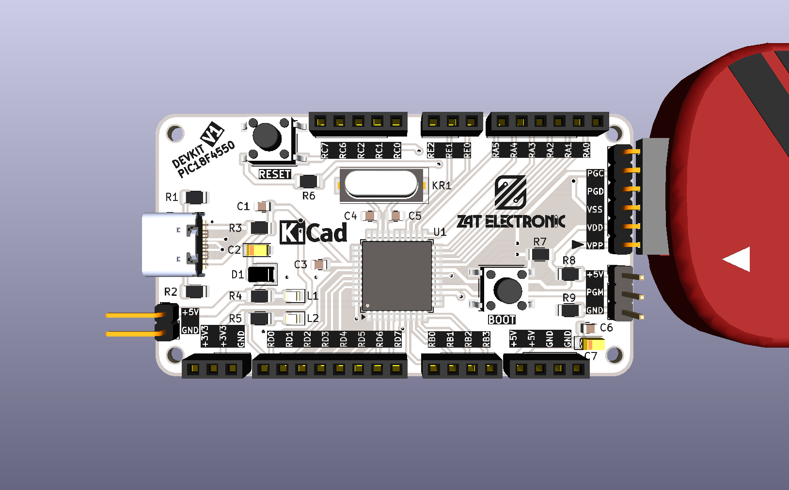
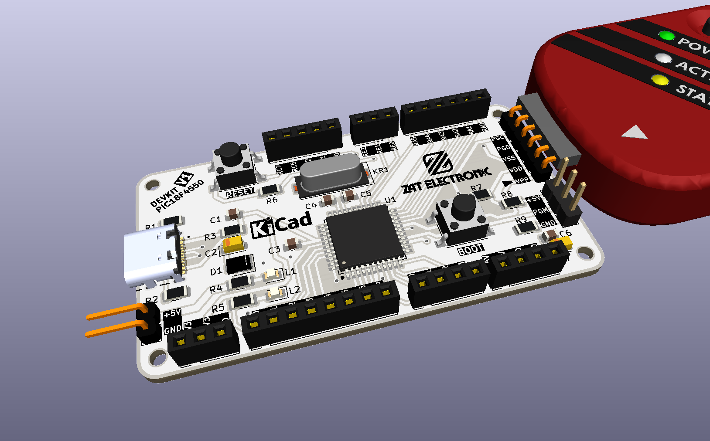
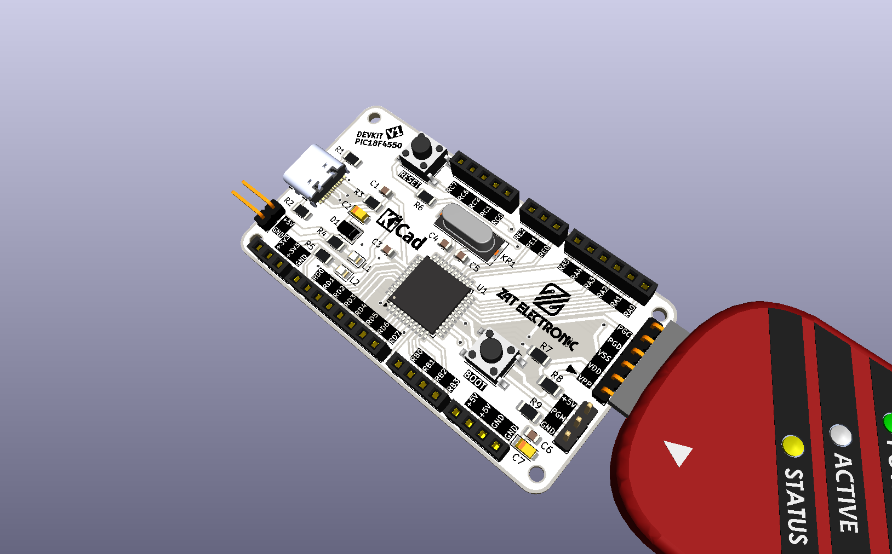
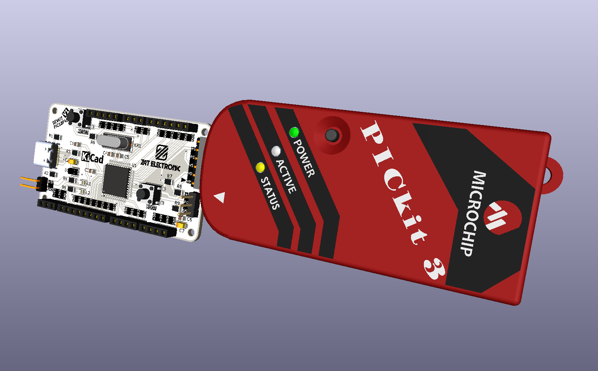

<div align="center">



# DEVKIT V1 PIC18F4550

**Kit de desenvolvimento profissional para o microcontrolador PIC18F4550 com USB nativo, programação via conector ICSP compatível com programador externo, reguladores 5V e 3,3V, oscilador SMD, botões RESET e BOOT, 2 LEDs de status e exposição completa de todos os ports GPIO**

[](https://www.kicad.org/)
[](https://www.microchip.com/en-us/product/pic18f4550)
[](.)
[](.)
[](.)
[](.)
[](.)
[](.)

</div>

---

## 📋 Índice

- [DEVKIT V1 PIC18F4550](#devkit-v1-pic18f4550)
  - [📋 Índice](#-índice)
  - [Visão Geral](#visão-geral)
  - [Renders 3D](#renders-3d)
  - [Arquitetura do Projeto](#arquitetura-do-projeto)
  - [Funcionalidades](#funcionalidades)
  - [Especificações Técnicas](#especificações-técnicas)
  - [Arquitetura de Alimentação](#arquitetura-de-alimentação)
  - [Interface USB Nativa](#interface-usb-nativa)
  - [Conector ICSP — Programação](#conector-icsp--programação)
    - [J5 — ICSP Principal (6 pinos angulado)](#j5--icsp-principal-6-pinos-angulado)
    - [J6 — Conector Auxiliar (3 pinos)](#j6--conector-auxiliar-3-pinos)
  - [Mapa Completo de Conectores e GPIO](#mapa-completo-de-conectores-e-gpio)
    - [J1 — Alimentação Externa (2 pinos)](#j1--alimentação-externa-2-pinos)
    - [J2 — Port RA (5 pinos)](#j2--port-ra-5-pinos)
    - [J3 — Port RC Superior (3 pinos)](#j3--port-rc-superior-3-pinos)
    - [J4 — Port RC Inferior (6 pinos)](#j4--port-rc-inferior-6-pinos)
    - [J7 — Port RE (4 pinos)](#j7--port-re-4-pinos)
    - [J8 — Port RB (4 pinos)](#j8--port-rb-4-pinos)
    - [J9 — Port RD (8 pinos)](#j9--port-rd-8-pinos)
    - [J10 — Alimentações (3 pinos)](#j10--alimentações-3-pinos)
  - [Lista de Materiais](#lista-de-materiais)
    - [Microcontrolador](#microcontrolador)
    - [USB Type-C e Alimentação](#usb-type-c-e-alimentação)
    - [Programador ICSP](#programador-icsp)
    - [Conectores GPIO](#conectores-gpio)
  - [Estrutura do Repositório](#estrutura-do-repositório)
  - [Como Usar](#como-usar)
    - [1. Gravando firmware via ICSP](#1-gravando-firmware-via-icsp)
    - [2. Alimentação](#2-alimentação)
    - [3. Modo Bootloader USB (BOOT)](#3-modo-bootloader-usb-boot)
    - [Exemplo de código — MPLAB XC8](#exemplo-de-código--mplab-xc8)
    - [Ferramentas recomendadas](#ferramentas-recomendadas)
  - [Sobre](#sobre)

---

## Visão Geral

**DEVKIT V1 PIC18F4550** é um kit de desenvolvimento completo para o microcontrolador **PIC18F4550-IPT** (TQFP-44 SMD), projetado pela **ZAT ELECTRONIC** utilizando **KiCad 10** com esquemático hierárquico dividido em quatro sub-folhas: **Microcontrolador**, **USB Type-C**, **Programador ICSP** e **Conexões GPIO**.

O PIC18F4550 é um microcontrolador de 8 bits da família PIC18 com **USB 2.0 Full Speed nativo** (RC4/D− e RC5/D+), memória Flash de 32KB, SRAM de 2KB e EEPROM de 256 bytes. O DEVKIT expõe todos os ports GPIO (RA, RB, RC, RD, RE) em conectores fêmea de 2,54mm, inclui reguladores de tensão **5V** e **3,3V** on-board, oscilador a cristal SMD de **8MHz**, botões **RESET** e **BOOT** tácteis SMD, **2 LEDs SMD** de status e conector **ICSP de 6 pinos** angulado compatível com programador externo.

> 💡 O modelo 3D do programador externo (`Microchip - PICkit3.stp`) está incluído no projeto — as imagens 3D mostram o DEVKIT conectado a um programador externo, evidenciando a integração direta pelo conector ICSP lateral.

---

## Renders 3D

<div align="center">


*Vista superior — PIC18F4550 TQFP-44, USB-C, cristal SMD, botões RESET/BOOT e conectores GPIO*

<br/>



*Vista isométrica — DEVKIT conectado ao programador externo pelo conector ICSP de 6 pinos*

<br/>



*Vista inferior isométrica — exposição completa dos ports RD (8 pinos) e RB (4 pinos) na borda inferior*

<br/>



*Visão completa do ecossistema — DEVKIT + programador externo para gravação de firmware*

</div>

---

## Arquitetura do Projeto

O projeto é organizado em **esquemático hierárquico** com 4 sub-folhas independentes:

```
DEVKIT_V1_PIC18F4550.kicad_sch  (folha raiz)
│
├── MICROCONTROLADOR.kicad_sch
│   ├── PIC18F4550-IPT (TQFP-44)
│   ├── Cristal 8MHz HC-49/SD SMD (KR1)
│   ├── Capacitores de cristal 22pF (C3, C4)
│   ├── Capacitor de desacoplamento USB 470nF (C5)
│   ├── Botão RESET táctil SMD (TACTIL_SWITCH1)
│   ├── Botão BOOT táctil SMD (TACTIL_SWITCH2)
│   ├── LEDs SMD 0805 — L1, L2
│   └── Resistores pull-up/proteção — R5, R6, R7
│
├── TYPE-C_USB.kicad_sch
│   ├── Conector USB-C (USB4105GFA SMD)
│   ├── Regulador 3,3V AMS1117-3.3 (U2 — SOT-223)
│   ├── Diodo Schottky SS1P3L (D1 — DO-220AA)
│   ├── Capacitores eletrolíticos 10µF/16V (C2, C8)
│   ├── Capacitores de desacoplamento 100nF (C1, C6)
│   ├── Resistores CC 5,1KΩ (R3, R4 — para USB-C)
│   ├── Resistores 1KΩ e 0Ω (R1, R2)
│   └── LED SMD (L1 — status alimentação)
│
├── PROGRAMADOR.kicad_sch
│   ├── Conector ICSP 6 pinos angulado (J5)
│   ├── Conector auxiliar de programação (J6)
│   └── Resistores pull-up 10KΩ (R8, R9)
│
└── CONEXÕES.kicad_sch
    ├── J1  — Conector alimentação +5V/GND (2 pinos)
    ├── J2  — Port RA (5 pinos: RA0–RA5)
    ├── J3  — Port RC superior (3 pinos: RC0–RC2)
    ├── J4  — Port RC inferior (6 pinos: RC6, RC7)
    ├── J7  — Port RE (4 pinos: RE0–RE2)
    ├── J8  — Port RB (4 pinos: RB0–RB3)
    ├── J9  — Port RD (8 pinos: RD0–RD7)
    └── J10 — Alimentações (3 pinos: +5V / +3,3V / GND)
```

---

## Funcionalidades

- ✅ **PIC18F4550-IPT** (TQFP-44 SMD) — MCU 8 bits, 32KB Flash, 2KB SRAM, 256B EEPROM
- ✅ **USB 2.0 Full Speed nativo** — RC4/D− e RC5/D+ conectados ao conector USB-C
- ✅ **Conector USB-C** (USB4105GFA SMD) — entrada moderna com resistores CC 5,1KΩ
- ✅ **Regulador 3,3V** (AMS1117-3.3 SOT-223) — saída 3,3V para periféricos de baixa tensão
- ✅ **Alimentação 5V** via USB-C ou conector externo J1
- ✅ **Cristal 8MHz SMD** (HC-49/SD) — oscilador externo de alta estabilidade
- ✅ **Botão RESET** (TACTIL_SWITCH1 — SMD 6×6×6mm) — reset do microcontrolador
- ✅ **Botão BOOT** (TACTIL_SWITCH2 — SMD 6×6×6mm) — entrada em modo bootloader USB
- ✅ **2 LEDs SMD 0805** (L1, L2) — indicadores de status programáveis
- ✅ **Conector ICSP J5** — 6 pinos angulado para programador externo (PGC, PGD, MCLR, VDD, VSS, VPP)
- ✅ **Conector auxiliar J6** — 3 pinos (+5V / PGM / GND) para programação low-voltage
- ✅ **Diodo Schottky SS1P3L** (DO-220AA) — proteção na linha VBUS
- ✅ **Todos os ports GPIO expostos** — RA, RB, RC, RD, RE em conectores fêmea 2,54mm
- ✅ **Capacitores de desacoplamento** distribuídos — C3, C4, C5, C6 (0805 SMD)
- ✅ **Capacitores eletrolíticos** C2, C7, C8 (EIA-3216 SMD) — filtragem de alimentação
- ✅ **4 furos de fixação** — montagem em painéis e caixas
- ✅ **Esquemático hierárquico** em 4 sub-folhas — organização profissional do projeto

---

## Especificações Técnicas

| Parâmetro | Valor |
|-----------|-------|
| **Microcontrolador** | PIC18F4550-IPT |
| **Encapsulamento MCU** | TQFP-44 (10×10mm, passo 0,8mm) |
| **Arquitetura** | 8 bits — PIC18 |
| **Memória Flash** | 32 KB |
| **SRAM** | 2 KB |
| **EEPROM** | 256 bytes |
| **USB** | Full Speed 2.0 nativo (12 Mbps) |
| **Clock** | 8 MHz (cristal externo HC-49/SD SMD) |
| **Tensão de operação** | 2,0V – 5,5V |
| **Tensão da placa** | 5V (USB-C ou J1) |
| **Regulador 3,3V** | AMS1117-3.3 (SOT-223) |
| **Conector USB** | USB-C — USB4105GFA SMD |
| **Conector ICSP** | 6 pinos angulado (PGC/PGD/MCLR/VDD/VSS/VPP) |
| **GPIO exposto** | RA (5), RB (4), RC (7), RD (8), RE (3) = 27 pinos |
| **Botões** | RESET + BOOT (SMD táctil 6×6×6mm) |
| **LEDs** | 2x SMD 0805 |
| **Resistores** | SMD 1206 |
| **Capacitores** | SMD 0805 + EIA-3216 |
| **Ferramenta de Projeto** | KiCad 10 — esquemático hierárquico |
| **Tipo de montagem** | SMD |

---

## Arquitetura de Alimentação

```
USB-C (VBUS 5V)
      │
  [SS1P3L D1]  ← Proteção Schottky
      │
     5V ──────────────────────────────────► J1 (+5V)
      │                                     J10 (+5V)
      │                                     VDD do PIC18F4550
      │
  [AMS1117-3.3 U2]
      │
    3,3V ────────────────────────────────► J10 (+3,3V)
                                           Periféricos 3,3V

Alimentação alternativa:
J1 (+5V / GND) ──► entrada direta de fonte externa 5V
```

---

## Interface USB Nativa

O PIC18F4550 possui **USB 2.0 Full Speed integrado** no próprio chip, sem necessidade de conversor externo:

```
USB-C (USB4105GFA)
    │
    ├── D− (CC1/CC2 com 5,1KΩ) ──► RC4/D− do PIC18F4550
    └── D+ (CC1/CC2 com 5,1KΩ) ──► RC5/D+ do PIC18F4550

R3, R4 (5,1KΩ) — resistores CC para identificação USB-C
C5 (470nF)     — capacitor de desacoplamento USB do PIC
```

> 💡 Para utilizar o USB, o firmware deve implementar a pilha USB do PIC18F4550 via bibliotecas como **Microchip USB Framework** ou **USB CDC** para comunicação serial virtual.

---

## Conector ICSP — Programação

O DEVKIT possui conector **ICSP de 6 pinos angulado (J5)** compatível com programador externo e conectores adicionais:

### J5 — ICSP Principal (6 pinos angulado)

| Pino | Sinal | Descrição |
|------|-------|-----------|
| 1 | PGC | Clock de programação (ICSP Clock) |
| 2 | PGD | Dado de programação (ICSP Data) |
| 3 | VSS | GND |
| 4 | VDD | +5V |
| 5 | VPP | Tensão de programação / MCLR |
| 6 | — | (não conectado) |

### J6 — Conector Auxiliar (3 pinos)

| Pino | Sinal | Descrição |
|------|-------|-----------|
| 1 | +5V | Alimentação |
| 2 | PGM | Low-Voltage Programming |
| 3 | GND | Terra |

> 🔴 Para programar com **programador externo** (ex: PICkit 3/4, ICD): conecte o cabo ICSP no conector J5. O modelo 3D do programador está incluído no projeto para visualização do encaixe.

---

## Mapa Completo de Conectores e GPIO

### J1 — Alimentação Externa (2 pinos)

| Pino | Sinal |
|------|-------|
| 1 | +5V |
| 2 | GND |

### J2 — Port RA (5 pinos)

| Pino | GPIO | Função alternativa |
|------|------|--------------------|
| 1 | RA0 | AN0 / ADC |
| 2 | RA1 | AN1 / ADC |
| 3 | RA2 | AN2 / VREF− |
| 4 | RA3 | AN3 / VREF+ |
| 5 | RA4 | T0CKI / C1OUT |
| 6 | RA5 | AN4 / SS / HLVDIN |

### J3 — Port RC Superior (3 pinos)

| Pino | GPIO | Função alternativa |
|------|------|--------------------|
| 1 | RC0 | T1OSO / T1CKI |
| 2 | RC1 | T1OSI / CCP2 |
| 3 | RC2 | CCP1 |

### J4 — Port RC Inferior (6 pinos)

| Pino | GPIO | Função alternativa |
|------|------|--------------------|
| 1 | RC6 | TX / CK (USART) |
| 2 | RC7 | RX / DT (USART) |

### J7 — Port RE (4 pinos)

| Pino | GPIO | Função alternativa |
|------|------|--------------------|
| 1 | RE0 | AN5 / RD |
| 2 | RE1 | AN6 / WR |
| 3 | RE2 | AN7 / CS |

### J8 — Port RB (4 pinos)

| Pino | GPIO | Função alternativa |
|------|------|--------------------|
| 1 | RB0 | INT0 / FLT0 / AN12 |
| 2 | RB1 | INT1 / AN10 |
| 3 | RB2 | INT2 / AN8 |
| 4 | RB3 | AN9 / CCP2 |

### J9 — Port RD (8 pinos)

| Pino | GPIO | Função alternativa |
|------|------|--------------------|
| 1 | RD0 | PSP0 |
| 2 | RD1 | PSP1 |
| 3 | RD2 | PSP2 |
| 4 | RD3 | PSP3 |
| 5 | RD4 | PSP4 |
| 6 | RD5 | PSP5 |
| 7 | RD6 | PSP6 |
| 8 | RD7 | PSP7 |

### J10 — Alimentações (3 pinos)

| Pino | Sinal |
|------|-------|
| 1 | +5V |
| 2 | +3,3V |
| 3 | GND |

---

## Lista de Materiais

### Microcontrolador

| Ref | Componente | Valor | Encapsulamento |
|-----|-----------|-------|----------------|
| U1 | Microcontrolador | PIC18F4550-IPT | TQFP-44 SMD |
| KR1 | Cristal | 8MHz | HC-49/SD SMD |
| C3, C4 | Capacitor cristal | 22pF | 0805 SMD |
| C5 | Capacitor USB | 470nF / 50V | 0805 SMD |
| TACTIL_SWITCH1 | Botão RESET | 6×6×6mm | SMD táctil |
| TACTIL_SWITCH2 | Botão BOOT | 6×6×6mm | SMD táctil |
| L1, L2 | LED status | SMD 0805 | 0805 SMD |
| R5 | Resistor LED | 1KΩ | 1206 SMD |
| R6 | Resistor pull-up MCLR | 10KΩ | 1206 SMD |
| R7 | Resistor pull-up BOOT | 10KΩ | 1206 SMD |

### USB Type-C e Alimentação

| Ref | Componente | Valor | Encapsulamento |
|-----|-----------|-------|----------------|
| USBC1 | Conector USB-C | USB4105GFA | SMD |
| U2 | Regulador 3,3V | AMS1117-3.3 | SOT-223 SMD |
| D1 | Diodo Schottky | SS1P3L | DO-220AA SMD |
| C1, C6 | Capacitor desacoplamento | 100nF / 50V | 0805 SMD |
| C2, C8 | Capacitor eletrolítico | 10µF / 16V | EIA-3216 SMD |
| C7 | Capacitor eletrolítico | 10µF / 16V | EIA-3216 SMD |
| R1 | Resistor | 0Ω (jumper) | 1206 SMD |
| R2 | Resistor | 1KΩ | 1206 SMD |
| R3, R4 | Resistores CC USB-C | 5,1KΩ | 1206 SMD |

### Programador ICSP

| Ref | Componente | Valor | Encapsulamento |
|-----|-----------|-------|----------------|
| J5 | Conector ICSP | 6 pinos angulado | Header 2,54mm |
| J6 | Conector auxiliar | 3 pinos | Header 2,54mm |
| R8 | Resistor pull-up PGC | 10KΩ | 1206 SMD |
| R9 | Resistor pull-up PGD | 10KΩ | 1206 SMD |

### Conectores GPIO

| Ref | Descrição | Pinos |
|-----|-----------|-------|
| J1 | Alimentação externa | 2 pinos (2,54mm angulado) |
| J2 | Port RA | 5 pinos fêmea 2,54mm |
| J3 | Port RC superior | 3 pinos fêmea 2,54mm |
| J4 | Port RC inferior | 6 pinos fêmea 2,54mm |
| J7 | Port RE | 4 pinos fêmea 2,54mm |
| J8 | Port RB | 4 pinos fêmea 2,54mm |
| J9 | Port RD | 8 pinos fêmea 2,54mm |
| J10 | Alimentações | 3 pinos fêmea 2,54mm |

---

## Estrutura do Repositório

```
DEVKIT_V1_PIC18F4550/
├── DEVKIT_V1_PIC18F4550.kicad_pro    # Arquivo de projeto KiCad
├── DEVKIT_V1_PIC18F4550.kicad_sch    # Esquemático raiz (hierárquico)
├── DEVKIT_V1_PIC18F4550.kicad_pcb    # Layout da PCB (KiCad 10)
├── DEVKIT_V1_PIC18F4550.kicad_prl    # Configurações locais
├── MICROCONTROLADOR.kicad_sch        # Sub-folha: MCU + cristal + botões + LEDs
├── TYPE-C_USB.kicad_sch              # Sub-folha: USB-C + reguladores + proteção
├── PROGRAMADOR.kicad_sch             # Sub-folha: ICSP + conector programador
├── CONEXÕES.kicad_sch                # Sub-folha: todos os conectores GPIO
├── PIC18F4550_DATASHEET.pdf          # Datasheet oficial do PIC18F4550
├── packages3D/                       # Modelos 3D arquivados (STEP / WRL)
│   ├── TQFP-44_10x10mm_P0.8mm.wrl
│   ├── USB4105GFA.STEP
│   ├── SOT-223.wrl
│   ├── Crystal_SMD_HC49-SD.wrl
│   ├── Tactal Switch - SMD 6x6x6.stp
│   ├── LED_0805_2012Metric.wrl
│   ├── D_SMP_DO-220AA.wrl
│   ├── Microchip - PICkit3.stp
│   ├── PinHeader_6X1_right.stp
│   ├── PinHeader_2X1_right.stp
│   └── *-Pin Header - Female - 2.54mm.step
├── fp-info-cache                     # Cache de footprints
├── imagem_1.png                      # Render 3D superior
├── imagem_2.png                      # Render 3D isométrico com programador
├── imagem_3.png                      # Render 3D traseiro
├── imagem_4.png                      # Render 3D completo com programador
└── README.md
```

---

## Como Usar

### 1. Gravando firmware via ICSP

1. Conecte o programador externo ao conector **J5** (6 pinos angulado)
2. Abra o **MPLAB X IDE** e configure o projeto para **PIC18F4550**
3. Selecione o programador (ex: PICkit 3/4) e clique em **Make and Program Device**
4. O LED de status confirmará o sucesso da gravação

### 2. Alimentação

```
Opção A — Via USB-C:
  Conecte cabo USB-C → alimentação automática 5V via VBUS

Opção B — Via conector externo J1:
  Aplique +5V no pino 1 e GND no pino 2 do conector J1
```

### 3. Modo Bootloader USB (BOOT)

```
1. Mantenha o botão BOOT pressionado
2. Pressione e solte o botão RESET
3. Solte o botão BOOT
4. O PIC18F4550 entrará em modo bootloader USB
5. Grave o firmware via software de bootloader (ex: HIDBootloader)
```

### Exemplo de código — MPLAB XC8

```c
#include <xc.h>

// Configurações básicas do PIC18F4550
#pragma config FOSC = HS        // Oscilador externo HS
#pragma config WDT = OFF        // Watchdog desabilitado
#pragma config MCLRE = ON       // MCLR ativo
#pragma config LVP = OFF        // Low-voltage programming off
#pragma config PBADEN = OFF     // PORTB digital

#define _XTAL_FREQ 8000000

void main(void) {
    TRISDbits.TRISD0 = 0;   // RD0 como saída (J9 pino 1)
    TRISDbits.TRISD1 = 0;   // RD1 como saída (J9 pino 2)

    while(1) {
        LATDbits.LATD0 = 1;  // RD0 HIGH
        __delay_ms(500);
        LATDbits.LATD0 = 0;  // RD0 LOW
        __delay_ms(500);
    }
}
```

### Ferramentas recomendadas

| Ferramenta | Finalidade |
|------------|-----------|
| MPLAB X IDE | IDE oficial para desenvolvimento PIC |
| XC8 Compiler | Compilador C para PIC de 8 bits |
| Programador externo | Gravação via ICSP (J5) |
| MPLAB Code Configurator | Geração automática de configuração de periféricos |
| Microchip USB Framework | Implementação da pilha USB do PIC18F4550 |

---

## Sobre

<div align="center">

Projetado por **ZAT ELECTRONIC**

*DEVKIT V1 PIC18F4550 — Made in Brazil 🇧🇷*

[](https://www.kicad.org/)
[](https://www.microchip.com/en-us/product/pic18f4550)
[](https://www.oshwa.org/)

</div>